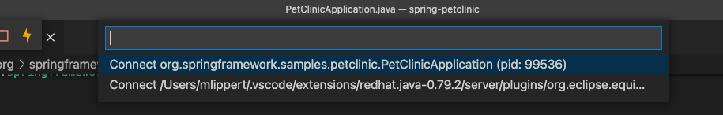

## Look inside of your running Spring Boot application

Spring Tools 4 can display live metadata information of a running Spring Boot application direclty in place in the source code.

### Configure the launch config

The live information is provided by [Spring Boot Actuators](https://docs.spring.io/spring-boot/docs/current/reference/htmlsingle/#actuator), so you need to have he Spring Boot Actuator module on the classpath of your project. In addition to that the information is exchanged between the running app and the tools via JMX, so you need to enable JMX for your app. This can be done by adding a specific JVM argument to the [launch configuration](command:workbench.action.debug.configure):

`"vmArgs": "-Dspring.jmx.enabled=true"`

### Show the live information

In order to connect to a running application, you need to execute the [Manage Live Spring Boot Process Connections](vscode-spring-boot.live-hover.connect) command (e.g. via the command palette).

Then, the command shows up a list of running processes, from which you can select the app to connect to.

Once connected, the live information shows up in place with the source code of your application.

### Update and disconnect

If you have VS Code connected to a running app, you can execute the same command again to refresh the information or to disconnect from the running app again. The quick pick choices will show you up with those options for connected processes.

